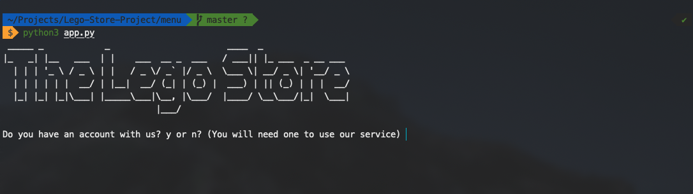
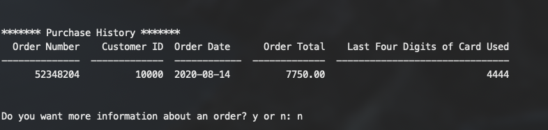
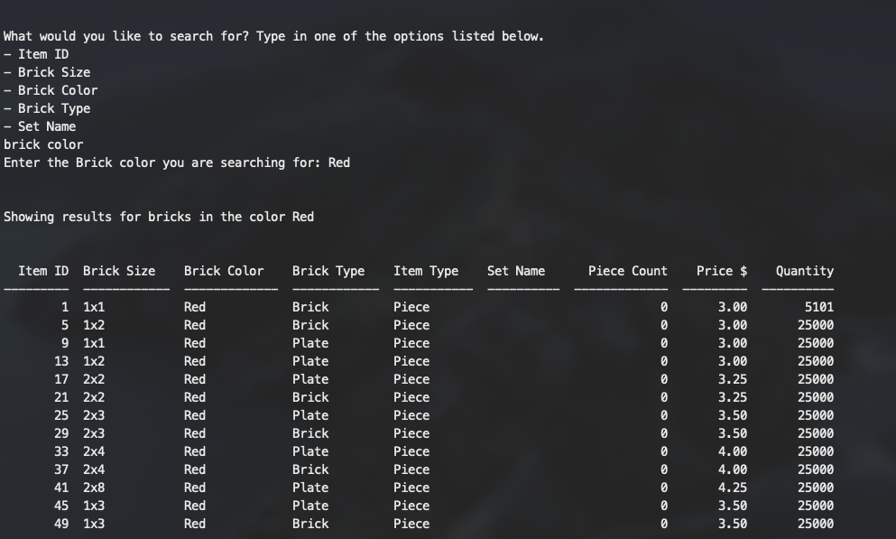
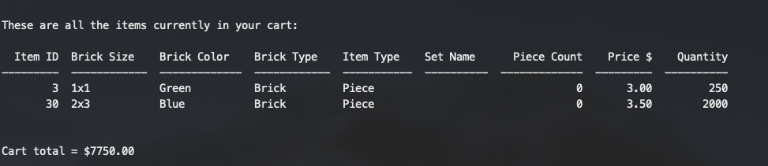

# Lego Store Project
This app is used to manage a lego store. 

## Table of contents
* [General info](#general-info)
* [Technologies](#technologies)
* [Access](#access)
* [Screenshots](#screenshots)
* [Takeaways](#takeaways) 

## General Info
A lego store database with a Python CLI menu that was the main project for my databasing class. The point of the project was to become better with SQL and to connect a backend with a front end menu powered using Python. The functionalities are described below: 

Employees can select the store mode option and which will require
the user to login to be able to access the options for store mode such as
   * Selling an item
   * Managing the inventory database
   * Managing the employees 
   
Users can select online mode which will only require a login/account creation for ordering items 
and checking purchase history. Online mode functions include
   * Browsing inventory
   * Searching for a specific item
   * Making a purchase
   * Checking purchase history
   
When a user makes a purchase, the database updates accordingly and the updated database is then displayed for the next user when they make an order. There is also quantity checking so when a user asks for an item that is out of stock or over the in stock quantity, they will be notified. Once an order is placed, the order is assigned a random order ID and then added to the order history for that user. Cards are also saved the the database for easier user checkout.  
   
## Technologies 
* Python 3.8
* SQL 
* Microsoft SQL Server with Docker on MacOS

## Access
I used Python 3.8.4 on Mac OS to build this program. 
In order to run this program you will need the python modules listed below:
   - pyodbc (https://pypi.org/project/pyodbc/)
   - tabulate (https://pypi.org/project/tabulate/)
   - pyfiglet (https://pypi.org/project/pyfiglet/)
   - pytabby (https://pypi.org/project/pytabby/)

These can be installed by running the following commands:
```
$ pip3 install pyodbc
$ pip3 install tabulate
$ pip3 install pyfiglet
$ pip3 install pytabby
```

Once you have all these different modules installed, you can run the program by going into the directory with the lego-store-project folder and typing 
```
$ cd menu
```
Once you are in the menu folder, you can run the following command and the menu will run. 
```
$ python3 app.py
```

There are also test scripts that could be run to fill a SQL database with test values in the database folder within in the lego-store-project folder. 

To get to store or online mode type in 'store' or 'online' and then you will be presented with options for that mode. When at the menus, in order to make a selection, enter the number of the option that contains the desired selection. 

To get out of the current mode, type 'main menu' from either mode and then type 'q' to quit the program. 

### TEST USER INFO
These are created when you run the SQL scripts in the database folder. 

To run program with an admin account use the following information when asked to login:
   - Employee ID: 1 
   - Password: 1234

To run program with a test user that has a test card saved to the account, use the following information:
   - Email: TestCustomer 
   - Password: 1234
   
## Screenshots
 
 

## Takeaways
Although this project did not have a fancy UI, I was able to further progress my development skills by learning the following: 
* SQL 
* Python 3
* Setting up a Microsoft SQL Server
* Connecting a CLI menu to a database
